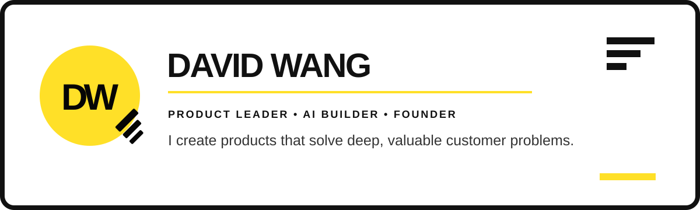

  

   

  
  
  

## I build, teach, and lead

For **18+ years**, I've built and scaled marketplace, commerce, mobile, payments, and AI products at companies including **Linktree, Kajabi, Airtasker, SocietyOne, and Westfield**.

I'm a senior product leader who still likes opening the editor and turning an idea into something people can try. Most of the projects here started with a problem I was personally tired of — locked-up meeting notes, generic learning tools, messy job searches, or shopping decisions that took far too much research.

I also built **[Product Academy](https://www.productacademy.io/)** to turn that experience into practical product education. That is what full-stack product leadership means to me: **find a deep customer problem, build the product, connect it to the business, and make the team stronger.**

<table>
  <tr>
    <td align="center"><strong>18+ years</strong> across 8+ product sectors</td>
    <td align="center"><strong>10M+ shoppers</strong> retail &amp; digital identity</td>
    <td align="center"><strong>6.5M+ downloads</strong> banking, creator &amp; marketplace apps</td>
    <td align="center"><strong>5,000+ learners</strong> product education</td>
  </tr>
</table>

| **BUILD** | **TEACH** | **LEAD** |
|---|---|---|
| Turn deep customer problems into working products — from first prototype to scaled platform. | Turn hard-won product judgement into practical courses, cohorts, tools, and coaching. | Set direction, align product/design/engineering, and grow the people doing the work. |

## Products I've built

| Product | The customer problem and the product bet |
|---|---|
| **[Product Academy](https://www.productacademy.io/)** · product education platform | Too much product education stops at frameworks. Product Academy combines self-paced courses, live cohorts, coaching, tools, and community so people can learn what to build, why it matters, and how to prove it. **Live business** · [free blueprint](https://www.productacademy.io/free-resources/how-to-become-a-product-manager/) |
| **[StoryLingo](https://github.com/productdave/storylingo)** · AI voice learning | Language practice is hard to sustain when it feels like homework. StoryLingo lets children speak with fairy-tale characters through real-time voice conversations. Built with OpenAI Realtime, Expo, React Native, and TypeScript. **Prototype** · [teaching version](https://github.com/productdave/storylingo-demo) |
| **[Granola Exporter](https://github.com/productdave/granola-exporter)** · macOS utility | Meeting knowledge should not be trapped inside one app. This native-feeling tool exports Granola notes and transcripts to local, searchable Markdown — with smart diffing, resumable exports, and a packaged macOS app. **Open source** · [releases](https://github.com/productdave/granola-exporter/releases) |
| **[Job Search OS](https://github.com/productdave/Job-Search-OS)** · agent workflow | Most job searches repeat the same work and throw away every outcome. This pair of agent skills finds and verifies roles, tailors truthful resumes, tracks results, and learns which positioning earns callbacks. **Open source** |
| **[Penny](https://github.com/productdave/Penny-Deals-Agent)** · AI shopping intelligence | Product research is noisy and poorly timed. Penny researches live prices and reviews, gives a clear **Buy / Wait / Track** recommendation, and monitors saved items for price drops. **Prototype** |
| **[Juno](https://github.com/productdave/juno-mac-cleaner-agent)** · AI desktop app | Mac storage tools can feel risky and opaque. Juno scans common caches, explains what is safe to clear, and adds an AI guide powered by Claude or local Ollama models. **Open source prototype** |
| **[Learnable](https://github.com/productdave/learnable-learn-anything)** · adaptive learning | Generic courses rarely fit the learner's goal or starting point. Learnable turns a topic into a structured course with research, lessons, practice, flashcards, search, text-to-speech, and an AI tutor. **Prototype** |
| **[Storyville](https://github.com/productdave/Storyville)** · multimodal social storytelling | AI stories often end after one prompt. Storyville explores a creator-and-fan network for episodic mini-dramas made from generated text, images, audio, and video. **MVP scaffold** |

I also published an earlier **[Product Manager resume-writing skill](https://github.com/productdave/product-manager-resume-writing-skill)**. Its core ideas — truthful tailoring, a reusable achievement bank, and learning from outcomes — grew into Job Search OS.

## Product Academy — teaching the craft

I built Product Academy because the hardest part of product management is not memorising a framework. It is developing the judgement to decide **what to build, why it matters, how to validate it, and how to bring people with you.**

> **Code is cheap. Good products are rare.**

<table>
  <tr>
    <td align="center"><strong>5,000+ students</strong> taught worldwide</td>
    <td align="center"><strong>9+ years</strong> teaching product</td>
    <td align="center"><strong>200+ classes</strong> delivered</td>
    <td align="center"><strong>17+ countries</strong> learner community</td>
  </tr>
</table>

What I teach mirrors how I lead:

- **Product judgement:** customer problems, jobs to be done, business context, and market dynamics.
- **From PRD to proof:** prioritisation, success metrics, product requirements, and AI-assisted prototypes.
- **Product leadership:** roadmaps, stakeholder influence, executive communication, and leading technical teams.
- **Career craft:** portfolios, resumes, networking, and interviews that show how someone actually thinks.

**[Explore Product Academy](https://www.productacademy.io/)** · **[Free Break-In Blueprint](https://www.productacademy.io/free-resources/how-to-become-a-product-manager/)** · **[Live Maven cohort](https://maven.com/productdave/ai-product-builder)** · **[Newsletter](https://app.productacademy.io/newsletters/product-dave-breaking-into-product-management)** · **[Weekly events](https://www.meetup.com/productacademy/)**

## Products and teams I've led at scale

Side projects show how I think with my hands. My day job has been turning the same product judgement into outcomes across larger teams and systems.

- **AI + creator tools:** launched Kajabi's GenAI ad-creation product for creator entrepreneurs.
- **Creator mobile:** led Linktree's 0→1 mobile app to **1M+ downloads and a 4.8-star rating**.
- **Retail + identity:** built Westfield digital identity products serving **10M+ shoppers** across online and in-centre experiences.
- **Mobile banking:** helped launch Commonwealth Bank's mobile app to **5M+ downloads and a 4.9-star rating**.
- **Services marketplace:** launched Airtasker's first mobile app to **500K+ downloads and a 4.9-star rating**.
- **Product education:** built Product Academy to **5,000+ learners**, with courses taught through the University of Melbourne, General Assembly, and Harvard Innovation Labs.

## How I work

- **Start with the customer tension.** A crisp problem is more valuable than a long feature list.
- **Prototype to learn.** I use AI and code to make product conversations concrete early.
- **Connect craft to the business.** Retention, revenue, cost, and trust belong in the product brief.
- **Teach to scale judgement.** I explain the why, model the work, and give teams tools they can reuse.
- **Make the team stronger.** I've led PMs, engineers, and designers through ambiguity, launches, and growth.

## What I'm looking for

I'm based in **Seattle** and exploring **Principal, Staff, Group PM, and product leadership roles** where I can work on AI, commerce, marketplaces, creator tools, mobile, or zero-to-one products.

I'm most useful where product strategy, hands-on building, and team leadership meet.

If you're building something useful in one of those spaces, I'd love to compare notes: **[LinkedIn](https://www.linkedin.com/in/davewang001/)** · **[david@davidwang.com.au](mailto:david@davidwang.com.au)**
